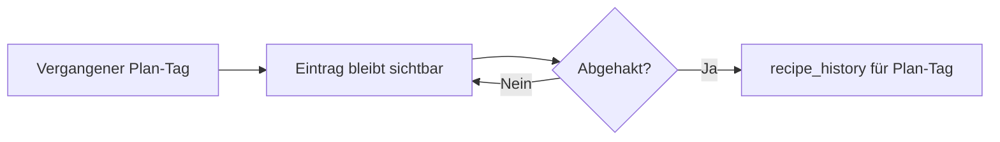

# Plan tool spec

Personal **dinner plan** for the next few days — rolling week view, smart suggestions, and one-click handoff to the shopping list.

**Last updated:** 2026-06-26

**Related:** [shopping-list-spec.md](./shopping-list-spec.md) (Phase 4 batch add from Plan)

---

## Implementation status

| Feature | Status | Notes |
|---------|--------|-------|
| Plan view `/plan` | ✅ Phase 1 | `PlanView.vue` |
| Rolling 7-day window (+ past with entries) | ✅ | `mealPlanStorage.ts` |
| Multiple recipes per day | ✅ | |
| Manual add/remove | ✅ | `AddToPlanSheet.vue` |
| Servings snapshot on add | ✅ | |
| Check off → `recipe_history` (plan date) | ✅ | `POST /api/recipes/:id/cook` + `cooked_date` |
| `localStorage` persistence | ✅ | `recipe-library-meal-plan-v1` |
| Move entry between days | ✅ | Phase 1.1 — `moveEntry` + `PlanAssignDaySheet` (Verschieben-Button) |
| Suggestion algorithm | ✅ | Phase 2 — `planSuggestionScore.ts` |
| Suggestion UI | ✅ | `PlanSuggestionsPanel.vue` — primary panel, deduped; tap → `PlanAssignDaySheet` |
| Batch → shopping list | ✅ | Phase 3 — `PlanShoppingBatchFlow.vue`, `planShoppingBatch.ts` |
| Backend plan persistence | 🔲 | Phase 4 — **TODO** |
| Historical calendar view | 🔲 | Phase 5 — needs backend |

---

## Goals

- Plan **Abendessen** for the next **5–7 Tage**, starting **ab heute** (rollierendes Fenster, keine feste Kalenderwoche).
- Am **Freitag** (oder früher, z. B. **Mittwoch** für Lebensmittel-Bestellung) die kommenden Tage füllen — typisch bis **Mittwoch/Donnerstag** der Folgewoche.
- Keine Unterscheidung Frühstück/Mittag/Abend als Slots; **ein Tag = ein oder mehrere Rezepte** (Hauptgericht, Dessert, Hefezopf am selben Tag).
- **Vorschläge** aus der Bibliothek nach mehreren Kriterien (Favoriten, Kochhistorie, Zeit, Gesundheit, Wochentag vs. Wochenende).
- **Einkauf:** Wochenplan mit einem Klick in die Einkaufsliste — danach **pro Rezept** der bestehende Picker + Merge (wie heute), nur nacheinander für alle geplanten Rezepte.

---

## Confirmed product decisions

| Topic | Decision |
|-------|----------|
| Meal type | **Nur Abendessen** im Plan; andere Mahlzeiten nicht als eigene Slots. |
| Slot model | **Kalendertage** (Mo 26.6., Di 27.6., …), nicht „Slot 1–5“ ohne Datum. |
| Horizon | **7 Tage** (heute + 6); Start = **heute** (konfigurierbar: „ab morgen“ später). |
| Mehrere Gerichte/Tag | **Ja** — z. B. Dinner + Dessert, oder Backrezept + Hauptgericht am selben Tag. |
| Planungsrhythmus | Freitag für Wochenende + neue Woche; idealerweise **früher** (Mi) wenn Bestellung nötig — UI zeigt immer **rollierend ab heute**, kein festes „Planungswochenende“. |
| Portionen | **Rezept-Standard**; beim Hinzufügen **angepasste Portion** aus dem Kontext (wie Einkaufs-Picker: Servings von der Detailansicht). |
| Persistence MVP | **`localStorage`** (eigenes Schema, versioniert). |
| Persistence später | **Backend** (SQLite + API), analog Einkaufsliste — explizites TODO. |
| Shopping | **Ein Button** startet Batch; **je Rezept** `AddToShoppingSheet` (Auswahl + Merge), nicht blind alles hinzufügen. |
| Vorschläge | **Algorithmus** (kein LLM im MVP); Nutzer wählt manuell aus Vorschlagsliste oder sucht selbst. |
| Vergangene Tage | **Bleiben sichtbar** in der Planliste; **kein** automatisches „gekocht“ beim Datumswechel. |
| Abhaken im Plan | Checkbox pro Eintrag → gilt als **für diesen Plan-Tag gekocht** → `recipe_history` (nur bei explizitem Abhaken). |
| `would_cook_again: no` | **Ausgeschlossen** aus Vorschlägen und Rezept-Auswahl im Plan (nicht planbar). |
| Max. Rezepte/Tag | **Kein hartes Limit**; ab **4** optional dezenter Hinweis (Edge Case Frühstück–Nachtisch). |

---

## User flows

### Planung (manuell)

```mermaid
flowchart TD
  Open[/plan] --> View[Rolling 5–7 Tage]
  View --> Add[Rezept zu Tag hinzufügen]
  Add --> Detail[Servings aus Rezept-Kontext]
  Detail --> Slot[Slot speichern]
  Slot --> View
```

1. Nutzer öffnet `/plan` — sieht die nächsten **7 Tage** (heute + 6) mit Wochentag + Datum.
2. Pro Tag: geplante Rezepte als Karten/Chips; leere Tage mit „Rezept hinzufügen“.
3. Hinzufügen: Rezept suchen/wählen (oder aus Vorschlägen) → Portionen bestätigen → Eintrag am gewählten Tag.
4. Optional: Reihenfolge innerhalb eines Tages, Entfernen, in anderen Tag verschieben.
5. **Abhaken:** Checkbox am Eintrag → als für **diesen Plan-Tag** gekocht markieren → `POST /api/recipes/:id/cook` mit `cooked_date` = Plan-Tag. Strikethrough in der UI (wie Einkaufsliste). **Ohne Abhaken** bleibt der Eintrag stehen — auch an vergangenen Tagen.

### Vergangene Tage

- Einträge **verbleiben** in der Liste, wenn das Datum vorbei ist (kein Auto-Discard, kein Auto-„gekocht“).
- Nutzer räumt selbst auf: abhaken (→ Historie) oder × entfernen.
- Begründung: Plan wird nicht zuverlässig 1:1 eingehalten; implizites Abhaken wäre irreführend.



### Planung (mit Vorschlägen, Phase 2)

1. Leerer Tag oder Bereich **„Vorschläge“** zeigt gerankte Rezepte.
2. Tipp auf Vorschlag → gleicher Add-Flow mit vorausgefüllten Portionen.
3. Bereits geplante Rezepte in der aktuellen Planperiode werden aus Vorschlägen ausgeschlossen (oder stark abgewertet).

### Einkauf aus Plan (Phase 3)

```mermaid
flowchart LR
  Plan[Wochenplan] --> Btn[Zutaten einkaufen]
  Btn --> R1[Picker Rezept 1]
  R1 --> R2[Picker Rezept 2]
  R2 --> Rn[…]
  Rn --> Shop[/shopping]
```

1. Button **„Zutaten einkaufen“** (oder „Zur Einkaufsliste“) auf `/plan`.
2. Für **jedes geplante Rezept** (alle Tage, alle Einträge, Reihenfolge: Tag → Eintrag):
   - `AddToShoppingSheet` mit Rezept + gespeicherten Portionen.
   - Nutzer bestätigt Auswahl (Defaults wie heute: pantry/spices/Wasser unchecked).
   - Merge in globale Liste + ggf. Merge-Vorschläge.
3. Nach letztem Rezept: Hinweis + Link zu `/shopping` (wie Toast nach Einzel-Rezept).

**Nicht:** alle Zutaten ohne Picker blind mergen.

---

## UI concept

### Layout (`PlanView.vue`)

- **Header:** „Plan“ + Untertitel mit Datumsbereich (z. B. „Fr 26. Jun – Di 30. Jun“).
- **Aktionen:** „Vorschläge aktualisieren“ (Phase 2), **„Zutaten einkaufen“** (Phase 3).
- **Hauptbereich:** vertikale Liste der **Tage** (mobile-first); Desktop optional 5-Spalten-Grid.
- **Tag-Zeile:**
  - Label: `Fr`, `26. Jun` — Hervorhebung **heute**.
  - Wochenende optisch leicht anders (mehr Zeit zum Kochen).
  - Einträge: Rezepttitel, Portionen, **Checkbox „gekocht“**, Link zur Detailansicht, × entfernen.
  - Abgehakte Einträge: durchgestrichen; vergangene Tage mit offenen Einträgen optisch hervorgehoben (z. B. dezenter Hinweis).
  - „+ Rezept“ pro Tag; ab **4 Einträgen** optional Hinweis „Ungewöhnlich viele Gerichte an einem Tag“ — **kein Block**.
- **Leerzustand:** Kurzer Text + Link zu Rezepten; optional „Plan mit Vorschlägen füllen“ (Phase 2, halbautomatisch).

### Kein Frühstück/Mittag

- Keine Meal-Type-Spalten.
- `role` optional nur als Metadaten (`main` | `extra`) für Sortierung innerhalb des Tages — kein Pflichtfeld.

---

## Data model

### Plan entry

```ts
interface PlanEntry {
  id: string                    // uuid
  recipeId: number
  recipeTitle: string           // denormalized for offline display
  servings: number              // snapshot at add time
  sortOrder: number             // within day
  role?: 'main' | 'extra'       // optional; default main
  addedAt: string               // ISO timestamp
  cookedAt: string | null       // ISO date (Plan-Tag) when user checked off in plan; null = offen
}

interface PlanDay {
  date: string                  // ISO date YYYY-MM-DD (local calendar)
  entries: PlanEntry[]
}

interface MealPlan {
  version: 1
  startDate: string             // first day shown (= usually today)
  dayCount: number              // 7 default, max 7
  days: PlanDay[]
  updatedAt: string
}
```

### Storage (MVP)

- Key: `recipe-library-meal-plan-v1`
- **Kein** automatisches Verwerfen vergangener Tage oder Einträge.
- Beim Öffnen: fehlende **Zukunftstage** bis `dayCount` (7) auffüllen, wenn das Fenster „nach vorne rutschen“ soll — **Vergangenheit bleibt**.
- Abhaken ruft Backend `POST /api/recipes/:id/cook` auf (`cooked_date` = Plan-Tag des Eintrags); bei Offline-Fehler: `cookedAt` lokal setzen und Retry-Hinweis (Detail in Implementierung).
- Migration path documented for v2 + backend (see Deferred).

### Backend (later — TODO)

Tables sketch (not implemented):

- `meal_plans` — id, user_id (single-user MVP: one row), start_date, day_count, updated_at
- `meal_plan_entries` — plan_id, date, recipe_id, servings, sort_order, role

Sync strategy should mirror shopping list decision (deferred in shopping-list-spec).

---

## Suggestion algorithm (Phase 2)

Deterministic scoring over eligible recipes (`status: confirmed`, not draft). No OpenAI in v1.

**Hard exclusions (never suggested, not pickable in Add-to-Plan):**

- `would_cook_again === 'no'`
- `status === 'draft'`
- Already in current plan period (same `recipeId` on an open slot — optional: allow re-add on different day)

### Inputs (available today)

| Signal | Source |
|--------|--------|
| Favorit | `recipe.favorite` |
| Would cook again | `recipe.would_cook_again` — nur `yes` / `maybe` / `null`; **`no` ausgeschlossen** |
| Kochhistorie | `recipe_history` / `GET /api/recipes/:id/history` |
| Häufigkeit | `count(cooked_date)` |
| Zuletzt gekocht | `max(cooked_date)` → Tage seitdem |
| Nie gekocht | count = 0 |
| Zeit | `prep_time_min`, `cook_time_min` (inkl. Schätzungen) |
| Tags | `quick`, `easy`, `comfort_food`, cuisine, dish type |
| Gesundheit | `health_score.healthScore` (wenn vorhanden) |
| Bereits im Plan | gleiche `recipeId` in aktueller Planperiode |

### Day context

| Context | Weekday (Mo–Do) | Friday | Weekend (Sa–So) |
|---------|-----------------|--------|-----------------|
| Zeitbudget | bevorzugt **kurz** (`quick`/`easy`, niedrige Gesamtzeit) | mittel | **lang** erlaubt |
| Passive Kochzeit | Bonus wenn `cook_time_min` hoch, `prep_time_min` niedrig (z. B. Bolognese) — „HO / mittags ansetzen“ | | |
| Aufwand | eher einfache Gerichte | | aufwendiger ok |

Wochentag aus **Slot-Datum**, nicht aus „heute“.

### Scoring sketch (v1)

Normalized score 0–100 per (recipe, targetDay). Gewichte tunable per Konstante.

```
score =
  w_fav   * favoriteBonus
+ w_wc    * wouldCookAgainBonus
+ w_freq  * cookFrequencyBonus        // bell curve: oft gekocht = gut, aber nicht linear
+ w_rec   * recencyPenalty            // stark negativ wenn vor < N Tagen gekocht
+ w_new   * neverCookedBonus          // moderate boost für ungekochte
+ w_time  * timeFitForDay              // passt prep+cook zum Wochentag
+ w_health* healthScoreNormalized
+ w_tag   * quickEasyBonus (weekday)
+ w_div   * diversityPenalty          // ähnliche Tags/Cuisine wie Nachbartage
- w_plan  * alreadyInPlanPenalty
```

**Recency:** z. B. innerhalb 7 Tage stark abwerten; nach 21+ Tagen wieder erhöhen.

**Frequency:** häufig gekocht + `would_cook_again: yes` = Top-Kandidat; selten gekocht aber Favorit = mittlerer Boost.

**Diversity:** wenn Mo–Mi schon `italian` / `pasta`, Donnerstag leicht andere Cuisine bevorzugen.

**Library growth:** ab ~50+ Rezepten zusätzlich **rotation pool** — Rezepte die seit X Monaten weder gekocht noch vorgeschlagen wurden, kleiner „Rediscovery“-Boost, damit nichts untergeht.

### Output

- Pro leerem Tag (oder globaler Sidebar): **Top 8–12** Vorschläge mit kurzem **Warum**-Hint (z. B. „Favorit · 3 Wochen her · schnell“).
- Filter: „Nur Favoriten“, „Nur ungekocht“ (optional später).

### Open algorithm questions

- [ ] Gewichte initial festlegen vs. in Settings tunable
- [x] `would_cook_again: no` — **hart ausschließen** (Plan + Vorschläge)
- [x] Draft-Rezepte — **ausgeschlossen**
- [ ] Passive cook heuristic: Schwellwerte `cook_time_min >= 90` && `prep_time_min <= 30`?

*Hinweis (Bibliothek, nicht Plan): Rezepte mit `would_cook_again: no` bleiben vorerst in der Rezeptliste — separates Thema (ausblenden/archivieren), nicht Teil des Plan-MVP.*

---

## Roadmap

### Phase 1 — Plan MVP ✅ (shipped)

- ✅ `PlanView`, `PlanDaySection`, `AddToPlanSheet`, `useMealPlan`, `mealPlanStorage`.
- ✅ 7-Tage-Fenster ab heute; vergangene Tage mit Einträgen bleiben sichtbar.
- ✅ Abhaken → `recipe_history` mit Plan-Tag (`cooked_date` im Cook-API).
- ✅ `would_cook_again: no` und Drafts nicht planbar.
- Optional später: Eintrag zwischen Tagen verschieben. ✅ `moveEntry` + „Verschieben“ → `PlanAssignDaySheet` in `PlanDaySection`.

### Phase 2 — Suggestions ✅ (shipped)

- ✅ `planSuggestionScore.ts` — deterministic scoring (favorite, history, time fit, diversity, …).
- ✅ `GET /api/recipes/plan-suggestion-context` — bulk cook history + health scores.
- ✅ `usePlanSuggestions.ts` + `PlanSuggestionsRow.vue` — top 8 Vorschläge pro Tag mit „Warum“-Hint.
- ✅ „Vorschläge aktualisieren“ in `PlanView`.
- ✅ „Woche vorschlagen“ — `PlanWeekSuggestSheet.vue`, `buildWeekPlanSuggestions()`.

### Phase 3 — Shopping batch ✅ (shipped)

- ✅ „Zutaten einkaufen“ auf `/plan`.
- ✅ Queue durch offene geplante Rezepte → `AddToShoppingSheet` nacheinander.
- ✅ Abschluss-Hinweis + Link `/shopping`.
- **Completes** [shopping-list-spec.md Phase 4](./shopping-list-spec.md#phase-4--plan-integration).

### Phase 4 — Backend plan & sync

See **[plan-shopping-persistence-spec.md](./plan-shopping-persistence-spec.md)** (decisions locked 2026-07-21).

- API + SQLite for meal plan (document or `meal_plan_entries`).
- **No** localStorage → server migration (empty start).
- Multi-device via last-write-wins; **no** user model.
- Retain ~**30 days** of plan entries; longer history via `recipe_history` calendar later.
- **Not** a prerequisite for shopping-history calendar layers (those are out of scope).

### Phase 5 — Cook calendar (deferred, simplified)

**Vision:** Kalender aus **`recipe_history`** (was gekocht wurde). Planer speichert keine langfristige „verpasst“-Archivierung; ~30 Tage Plan-Retention reicht.

| Layer | Source | Notes |
|-------|--------|-------|
| Gekocht | `recipe_history` | ✅ already; basis for calendar |
| Geplant (kürzlich) | Backend plan (~30d) | Optional overlay; not long archive |
| Eingekauft, nicht gekocht | — | **Out of scope** |

**MVP calendar:** Monatsraster aus Cook-Daten; Tap → Rezeptdetail.

---

## UI components (planned)

| Piece | Location |
|-------|----------|
| `mealPlanTypes.ts` | Entry/day/plan types |
| `mealPlanStorage.ts` | `localStorage` load/save, roll-forward |
| `useMealPlan.ts` | Plan state + mutations |
| `planSuggestionScore.ts` | Scoring (Phase 2) ✅ |
| `PlanView.vue` | Main UI |
| `PlanDaySection.vue` | One day + entries |
| `AddToPlanSheet.vue` | Pick recipe + servings for a day |
| `PlanSuggestionsPanel.vue` | Primary suggestions grid; tap opens day assignment ✅ |
| `PlanAssignDaySheet.vue` | Compact day picker (Heute/Morgen/Do …) for move + suggest ✅ |
| `planAssignDays.ts` | Build assign-day options from visible plan window ✅ |
| `usePlanSuggestions.ts` | Loads recipes + context, scores per day (Phase 2) ✅ |
| `PlanShoppingBatchFlow.vue` | Orchestrates multi-recipe picker (Phase 3) ✅ |
| Reuse | `AddToShoppingSheet.vue`, `useShoppingList.ts` |

---

## Tests (planned)

- `mealPlanStorage` — future days fill, past days retained, cookedAt
- `planSuggestionScore` — fixture recipes, weekday vs weekend ordering
- Integration: add 2 recipes same day, batch shopping queue order
- Portion snapshot preserved on plan entry

---

## Deferred / explicit TODOs

| ID | Item | Notes |
|----|------|-------|
| **PLAN-TODO-1** | Backend persistence | See [plan-shopping-persistence-spec.md](./plan-shopping-persistence-spec.md) |
| **SHOP-TODO-1** | Shopping list + aisle order backend | Same epic; no shopping history |
| **PLAN-TODO-2** | Multi-user / auth | **Won’t do** (no user model) |
| **PLAN-TODO-3** | „Ab morgen“ als Startoption | Nice-to-have after MVP |
| **PLAN-TODO-5** | Rezepte mit `would_cook_again: no` in Bibliothek ausblenden/archivieren | Optional, außerhalb Plan-MVP |
| **PLAN-TODO-6** | Cook calendar from `recipe_history` | After PLAN-TODO-1 optional; not shopping-based |

---

## Open product questions

- [x] Vergangene Tage: **in Planliste belassen**, manuell abhaken → `recipe_history`; **kein** Auto-„gekocht“
- [x] Max Einträge/Tag: **kein Limit**; optional Hinweis ab 4
- [x] `would_cook_again: no`: **nicht planbar**
- [ ] Plan teilen / exportieren (Textliste der Woche)?
- [ ] Vergleich mit externen Planern (z. B. Mela) — bewusst out of scope für v1

---

## Changelog

| Date | Change |
|------|--------|
| 2026-06-26 | Initial spec from product discussion (5–7 day dinner plan, suggestions, shopping batch, localStorage + backend TODO). |
| 2026-07-21 | Persistence decisions: multi-device, no auth, no LS migration, ~30d plan retention, cook calendar later, no shopping history. |
| 2026-06-26 | Phase 2 suggestions: scoring, per-day UI, plan-suggestion-context API. |
