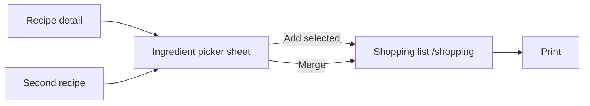

# Shopping list spec

Personal grocery list generated from recipe ingredients. Frontend-only (`localStorage`), optimized for printing at the store.

**Last updated:** 2026-06-26

---

## Implementation status

### Shipped (Phase 1 — MVP)

| Feature | Status | Notes |
|---------|--------|-------|
| Add from recipe (picker sheet) | ✅ | `AddToShoppingSheet.vue` |
| Shopping icon on recipe detail + cooking mode | ✅ | `RecipesView.vue` |
| Portion scaling from detail servings | ✅ | |
| Default unchecked: `pantry`, `spices` | ✅ | `shoppingListDefaults.ts` |
| Merge by ingredient name + category | ✅ | `shoppingListMerge.ts` |
| Amount merge (g/kg, ml/l, same unit) | ✅ | Ranges and mixed units stay comma-separated |
| Display format `Tomaten (400g)` | ✅ | `shoppingListFormat.ts` |
| Group by category (German labels) | ✅ | |
| Supermarket aisle order | ✅ | `constants/shoppingCategoryOrder.ts` |
| Alphabetical within category | ✅ | `shoppingListSort.ts` |
| Shopping view `/shopping` | ✅ | `ShoppingView.vue` |
| Print (`window.print`) | ✅ | Hides app chrome |
| Clear entire list | ✅ | Confirm dialog |
| `localStorage` persistence | ✅ | Key `recipe-library-shopping-list-v2` (migrates from v1) |
| Toast + link after add | ✅ | |
| “Rezepte auf dieser Liste” (screen only) | ✅ | Links to recipes; hidden when printing |
| Per-item check-off (strikethrough) | ✅ | Screen only; checked rows omitted from print |
| Remove single ingredient line | ✅ | × per row |
| Remove recipe from list | ✅ | × on recipe chip; contribution model |
| Default unchecked: tap water | ✅ | `Wasser`, `kochendes Wasser`, etc. |
| Unit tests | ✅ | `frontend/tests/utils/shoppingList.test.ts` |

### Shipped (Phase 2 — in-store ergonomics)

| Feature | Status | Notes |
|---------|--------|-------|
| Configurable aisle order | ✅ | `ShoppingAisleOrderSettings.vue`, `shoppingCategoryOrderStorage.ts` |

### Shipped (Phase 3 — intelligence, frontend-only)

| Feature | Status | Notes |
|---------|--------|-------|
| Merge suggestions (manual confirm) | ✅ | `MergeSuggestionSheet.vue`, `shoppingListMergeSuggestions.ts` |
| Copy as plain text | ✅ | `shoppingListExport.ts`, Kopieren button on `/shopping` |

### Shipped (Phase 3.5 — manual add)

| Feature | Status | Notes |
|---------|--------|-------|
| Manual ingredient add | ✅ | `ManualAddIngredientSheet.vue` |
| Autocomplete from curated staples | ✅ | `commonShoppingIngredients.ts`, Fuse.js search |

### Not yet implemented

| Feature | Planned phase |
|---------|----------------|
| Nav badge (open item count) | Phase 2 (optional, skipped) |
| Backend / multi-device sync | Phase 4 | See [plan-shopping-persistence-spec.md](./plan-shopping-persistence-spec.md) — list + aisle order; no LS migration |
| Batch add from Plan | ✅ | `PlanShoppingBatchFlow.vue` on `/plan` |

---

## Roadmap

### Phase 1 — MVP ✅ (done)

Core flow: recipe → picker → merged list → print → clear all.

See [UI components](#ui-components-implemented) and [Confirmed product decisions](#confirmed-product-decisions).

### Phase 2 — In-store ergonomics ✅ (done)

- ✅ **Per-item check-off** — strikethrough on screen; checked rows hidden when printing.
- ✅ **Remove by recipe** — × on recipe chips; uses per-recipe `contributions` (`localStorage` key `recipe-library-shopping-list-v2`, migrates from v1).
- ✅ **Remove single line** — × per ingredient row.
- ✅ **Default unchecked** — `pantry`, `spices`, and tap water (`Wasser`, `kochendes Wasser`, …).
- ✅ **Configurable category order** — collapsible “Supermarkt-Gangfolge” on `/shopping`; persisted in `recipe-library-shopping-category-order`.
- Nav badge (optional) — **not implemented** (skipped).

### Phase 3 — Intelligence (frontend-only) ✅

- ✅ **Merge suggestions** after list changes (e.g. “Rispentomaten zu Tomaten?”) — manual confirm only; substring match in same category, min length 4, stopwords (`Ei`, `Tee`, `Öl`).
- ✅ **Copy as plain text** — “Kopieren” on `/shopping`; unchecked items only, grouped by category.
- Backend persistence — **deferred** → [plan-shopping-persistence-spec.md](./plan-shopping-persistence-spec.md) (list + aisle order; last-write-wins; no user model).

### Phase 3.5 — Manual add ✅

- ✅ **“Zutat hinzufügen”** on `/shopping` — amount-free lines merged like recipe ingredients.
- ✅ **Autocomplete** from `COMMON_SHOPPING_INGREDIENTS` (~90 German supermarket staples with category keys); free text falls back to `other`.
- Manual entries use `MANUAL_SHOPPING_SOURCE` (id `0`); hidden from “Rezepte auf dieser Liste”.

### Phase 4 — Plan integration ✅

- ✅ Batch add from **Plan** (`/plan` → „Zutaten einkaufen“) — sequential `AddToShoppingSheet` per open plan entry. See [plan-tool-spec.md](./plan-tool-spec.md) Phase 3.

---

## Goals

- From a recipe, pick which ingredients to add to a shared shopping list.
- Group items by ingredient category (German labels) in supermarket aisle order.
- Merge duplicate ingredients when adding multiple recipes.
- Print a clean list for in-store use.

## User flow



1. User opens a recipe and taps the shopping icon in the ingredients panel (cooking mode included).
2. Sheet shows all ingredients with checkboxes and the current portion count from the detail view.
3. User confirms → selected rows merge into the global list.
4. `/shopping` shows the list grouped by category; user can print or clear the entire list.

## Confirmed product decisions

| Topic | Decision |
|-------|----------|
| Portions | Use the servings shown on the recipe detail when adding (scaled amounts). |
| Default unchecked | Categories `pantry`, `spices` (Gewürze), and tap water by name (`Wasser`, `kochendes Wasser`, …). |
| Persistence | MVP: `localStorage`. **Next:** server document ([plan-shopping-persistence-spec.md](./plan-shopping-persistence-spec.md)); aisle order server-side; no migration from LS. |
| Item check-off | Strikethrough on screen; checked rows not printed. |
| Clear | Whole list only (`Liste leeren`) in MVP. |
| Name merge | Same ingredient + category; German singular/plural normalize to one key (Süßkartoffel ↔ Süßkartoffeln). No fuzzy merge (Tomaten ≠ Rispentomaten). |
| Display format | `Tomaten (400g)` — name first, amounts in parentheses as a rough hint. |
| Within category | Sort alphabetically by ingredient name (German locale). |
| Category order | Supermarket aisle order in `frontend/src/constants/shoppingCategoryOrder.ts`. |

## Ingredient categories (German UI)

Store aisle order (used on `/shopping`):

| Order | Key | Label |
|------:|-----|--------|
| 1 | `produce` | Obst & Gemüse |
| 2 | `spices` | Gewürze |
| 3 | `grains` | Getreide & Hülsenfrüchte |
| 4 | `baking` | Backen |
| 5 | `oils_fats` | Öle & Fette |
| 6 | `sauces` | Soßen & Würzsaucen |
| 7 | `meat_fish` | Fleisch & Fisch |
| 8 | `dairy_eggs` | Milchprodukte & Eier |
| 9 | `beverages` | Getränke |
| 10 | `frozen` | Tiefkühl |
| 11 | `pantry` | Vorratsschrank |
| 12 | `other` | Sonstiges |

Keys must stay in sync with `frontend/src/constants/ingredientCategories.ts` and `backend/src/constants/ingredientCategories.js`.

## Data model (current)

```ts
interface ShoppingAmountPart {
  amount: number | null
  amountMax: number | null
  unit: string | null
}

interface ShoppingContribution {
  recipeId: number
  recipeTitle: string
  amountParts: ShoppingAmountPart[]
}

interface ShoppingListItem {
  id: string
  ingredientName: string
  category: string | null
  amountParts: ShoppingAmountPart[]
  contributions: ShoppingContribution[]
  sourceRecipes: { id: number; title: string }[]
  checked: boolean
}
```

Merge key: `normalize(ingredientName) + "|" + (category ?? "other")`.

**Limitation:** v1 lists migrated with multiple source recipes may not split amounts perfectly when removing a single recipe (see migration in `shoppingListStorage.ts`). New adds use full contribution tracking.

**UI (shipped):**

- On `/shopping`, section **“Rezepte auf dieser Liste”** with links and × to remove a recipe (screen only, not printed).
- Each ingredient row: checkbox (check-off), × (remove line).

## Amount merge rules

| Case | Behavior |
|------|----------|
| Same unit (normalized) | Sum `amount` values |
| Mass (`g`, `kg`, `mg`) | Convert to grams, sum, display in g or kg |
| Volume (`ml`, `l`, `cl`, `dl`) | Convert to ml, sum, display in ml or l |
| Count (`Stück` / `Stk`) | Sum when unit family matches |
| Range (`amountMax` set) | Do not merge with other parts; keep separate |
| Incompatible units | Comma-separated in parentheses: `Tomaten (200g, 1 Handvoll)` |

`additional_info` (prep notes) is omitted from shopping lines in MVP.

## Remove recipe from list (Phase 2+ design notes)

**User need:** After adding ingredients from a recipe, undo that add — e.g. meal plan changed, wrong recipe, duplicate add.

**Why it is hard:** Merged rows combine amounts from multiple recipes. Example: Pasta adds `Tomaten (400g)`, Salad adds `Tomaten (200g)` → list shows `Tomaten (600g)` with `sourceRecipes: [Pasta, Salad]`. Removing Pasta requires subtracting 400g, not deleting the row.

### Option A — Per-recipe contributions (recommended)

Extend the model so each list item tracks contributions:

```ts
interface ShoppingContribution {
  recipeId: number
  recipeTitle: string
  amountParts: ShoppingAmountPart[]
  addedAt: string // ISO, optional
}

interface ShoppingListItem {
  // ...
  contributions: ShoppingContribution[]
}
```

- On add: append a contribution per source recipe (before or instead of flat merge).
- Display: still merge `amountParts` for the line text.
- On remove recipe `id`: strip matching contributions, recompute `amountParts`, drop item if empty.
- **Pros:** Correct undo, supports multiple adds from same recipe (contributions stack).
- **Cons:** More storage; need `subtractAmountParts` inverse of merge logic.

### Option B — Addition batches

Each “Hinzufügen” creates a batch id; list is rebuilt from all batches minus removed ones.

- **Pros:** Simple mental model; full undo of one picker session.
- **Cons:** Same ingredient from one recipe in two sessions = two batches; cross-batch merge only at display time.

### Option C — Remove only when sole source

If `sourceRecipes.length === 1`, delete the row; otherwise show message: *“Tomaten auch von Salad — bitte manuell anpassen”* or only allow full list clear.

- **Pros:** Minimal code change.
- **Cons:** Weak UX once multiple recipes are on the list.

### Option D — Rebuild list from recipe set

Maintain `activeRecipeIds: number[]` + last-known picker selections per recipe; list is always derived.

- **Pros:** Single source of truth.
- **Cons:** Must persist per-recipe selections and servings; heavy refactor.

**Recommendation:** Option A when implementing remove-by-recipe. Migrate `localStorage` to `recipe-library-shopping-list-v2` with contributions; backfill `contributions` from existing rows as a single anonymous contribution if needed.

**UI (shipped in MVP):**

- On `/shopping`, section **“Rezepte auf dieser Liste”** lists contributing recipe titles as links to the recipe detail. **Screen only — not included in print.** No remove control yet.

**UI (Phase 2 — remove):**

- Add remove (×) per recipe chip/link when contribution tracking (Option A) exists.
- Optional: on recipe detail, if recipe is on the list — *“Vom Einkauf entfernen”*.

## UI components (implemented)

| Piece | Location |
|-------|----------|
| `recipeShoppingIngredients.ts` | Extract structured rows from `Recipe` |
| `shoppingListMerge.ts` / `shoppingListFormat.ts` | Merge + line formatting |
| `shoppingListSort.ts` | Group + sort |
| `shoppingCategoryOrder.ts` | Aisle order constant |
| `shoppingListSources.ts` | Unique source recipes for list header |
| `shoppingCategoryOrderStorage.ts` | Custom aisle order in `localStorage` |
| `commonShoppingIngredients.ts` | Curated staples for manual add autocomplete |
| `commonIngredientSearch.ts` | Fuse.js search over staples |
| `shoppingListExport.ts` | Plain-text format + clipboard copy |
| `shoppingListMergeSuggestions.ts` | Substring merge hints (manual only) |
| `useShoppingList.ts` | `localStorage` read/write |
| `AddToShoppingSheet.vue` | Picker modal |
| `ManualAddIngredientSheet.vue` | Manual add with autocomplete |
| `MergeSuggestionSheet.vue` | Confirm merge pairs |
| `ShoppingAisleOrderSettings.vue` | Reorder category groups |
| `ShoppingView.vue` | List + print + clear + copy + manual add |
| `ShoppingListIcon.vue` | Icon |
| Shopping icon entry | `RecipesView.vue` ingredients header (detail + cooking mode) |

## Print

- `window.print()` from shopping view.
- Print CSS hides app shell / bottom nav; only category groups and ingredient lines print.
- **Not printed:** page header, actions, and **“Rezepte auf dieser Liste”** (screen-only context).
- No checkboxes on printed output (MVP has no check-offs anyway).

## Tests

Vitest (`frontend/tests/utils/shoppingList.test.ts`):

- `isIngredientSelectedByDefault`
- `formatShoppingLine`
- `mergeShoppingItems` / `mergeAmountParts`
- `groupShoppingListItems` (aisle order)
- `collectSourceRecipes` (excludes manual source)
- `findMergeSuggestions` / `mergeItemsById`
- `formatShoppingListAsText`
- `searchCommonShoppingIngredients` / `matchCommonIngredient`
- `shoppingCategoryOrderStorage` (move + persist)

**Future tests:**

- `subtractContributionsForRecipe` edge cases
- Migration v1 → v2 storage
